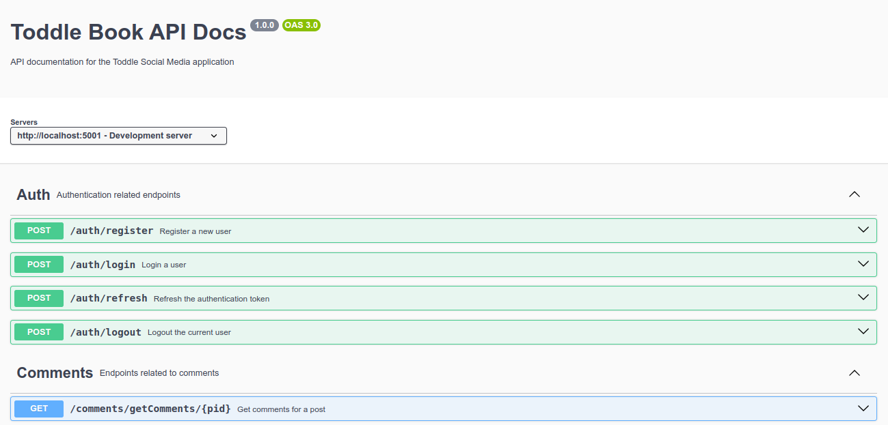
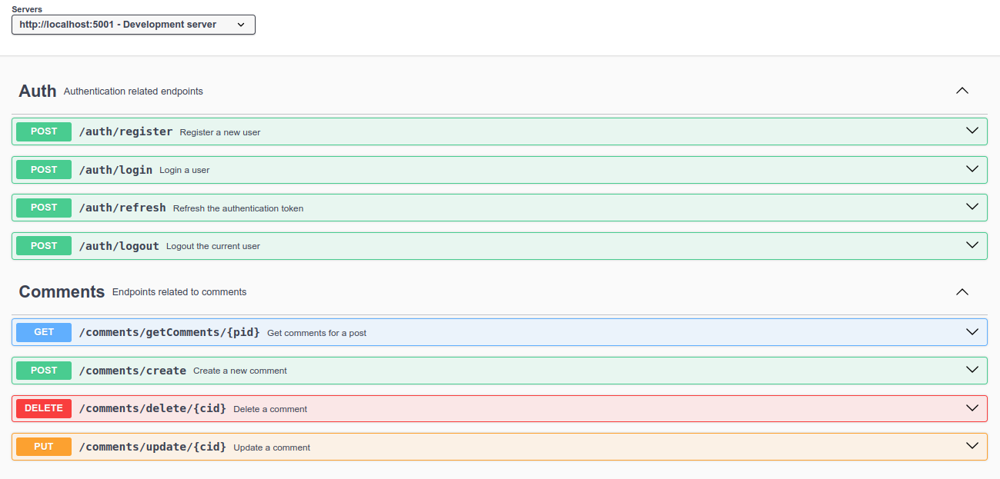
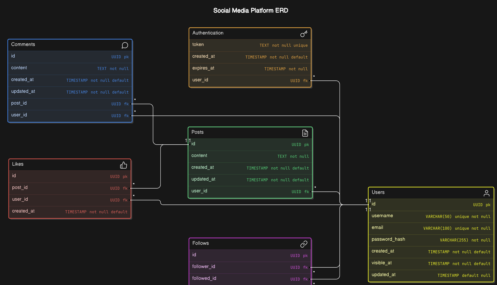

# Social Media Backend Assignment (Social Media App)



Welcome to Social Media Backend made by Aman Singh! This project is a social media application backend developed as part of Social Media recruitment process. Below are the steps to set up the project on your system.

## Setup Instructions

### 1. Download and Extract the zip

By now, you'd have done this step already.

### 2. Create `.env` File

Create a `.env` file in the root directory of the project based on the provided `.env.example` file. Add your database connection details and other environment variables as needed.

### 3. Install Dependencies

Navigate to the project directory and install the required dependencies using npm:

```bash
cd Social Media-backend-assignment
npm install
```

### 4. Database Setup

Run the following command to set up the database schema:

```bash
npm run db-setup
```

This will create the necessary tables in your database according to the schema defined in the project.

### 5. Start the Server

Start the server by running:

```bash
npm start
```

The server will start running at `http://localhost:3000`.

## Additional Information

- **Swagger Docs**: Once the server is running, you can access the Swagger documentation for the API at [http://localhost:3000/api-docs](http://localhost:3000/api-docs).



- **SQL Docs** : Docs for SQL schema are available in [Docs](/Docs/schemas.md)

- **ER Diagram**: The Entity - Relationship Diagram for the Database Schema is as below

